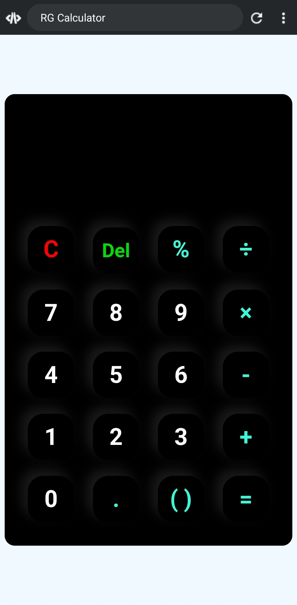

# RG Calculator

A responsive web-based calculator built with **HTML, CSS, and JavaScript**.  
It supports basic arithmetic, percentages (processed when `=` is pressed), and smart brackets with input validation — designed to behave like a real calculator.



## 🚀 Live Demo
https://rufta-g20.github.io/CodeAlpha_Build-a-Calculator/

## 📌 Features
- Addition, subtraction, multiplication, division.
- Percentage (`%`) handled on `=` (e.g., `50%` → `0.5`).
- Smart brackets `()` with rules to prevent invalid placement.
- Clear (`C`) and delete (`Del`) actions.
- Error handling for invalid expressions.
- Clean, responsive UI.

## 🛠️ Tech Stack
- HTML5  
- CSS3  
- Vanilla JavaScript

## 📂 How to Run
1. Download or clone: ```bash
   https://github.com/rufta-g20/CodeAlpha_Build-a-Calculator.git
   ```
2. Open index.html in your browser.
